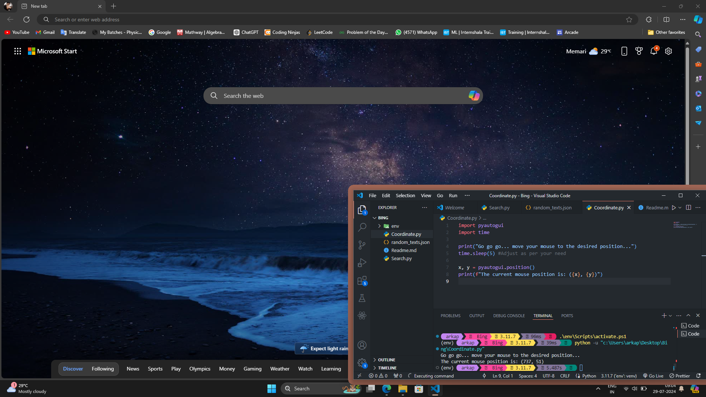
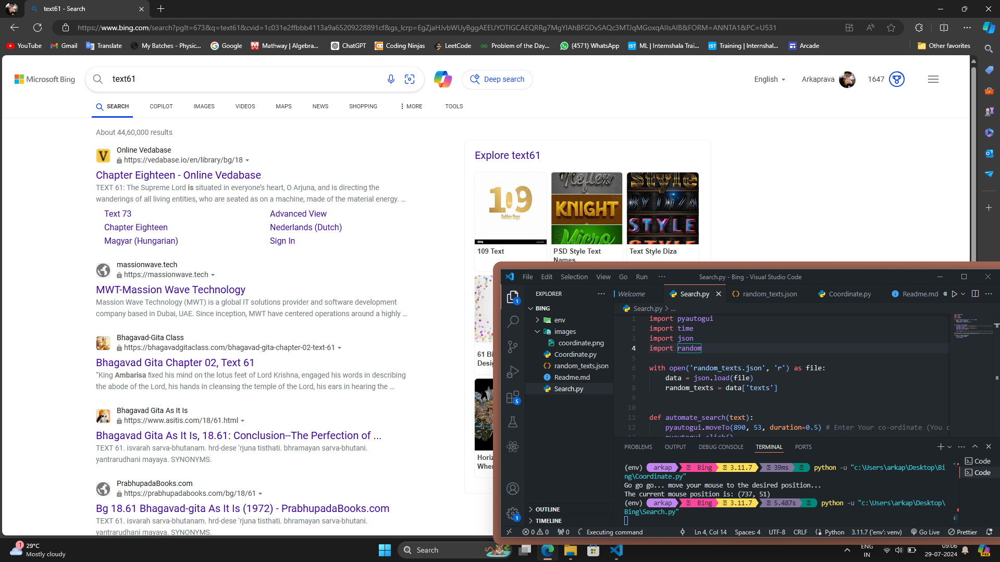

# 🛠️ PyAutoGUI Automation Script

Welcome to the PyAutoGUI Automation Script repository! This script leverages the power of PyAutoGUI to automate mouse movements and clicks based on specific coordinates. Perfect for automating repetitive tasks on your computer.

## 🚀 Tech Stack

- **Language**: Python
- **Library**: PyAutoGUI

## 📦 Installation

To get started, you'll need to install the PyAutoGUI library. You can do this easily using pip:

```bash
pip install pyautogui
```

## 🛠️ Usage

1. **Find Coordinates**:
    - Open `coordinate.py`.
    - Adjust the `time.sleep(5)` value as needed to give yourself time to hover over the target area.
    - Run `coordinate.py`. 
    - Hover your mouse over the search bar or desired location.
    - The script will display the coordinates. Copy these coordinates for the next step.

    ```python
    # coordinate.py
    import pyautogui
    import time

    time.sleep(5)
    print(pyautogui.position())
    ```

    

2. **Modify and Run the Script**:
    - Open `Search.py`.
    - Replace the placeholder coordinates in `pyautogui.moveTo(x, y, duration=0.5)` with the coordinates you obtained.

    ```python
    # Search.py
    import pyautogui

    pyautogui.moveTo(890, 53, duration=0.5)  # Modify these coordinates
    ```

    - Save the changes and run `Search.py` to see the automation in action.

    

## 🖼️ Screenshots

- **Finding Coordinates**: 
    

- **Running the Script**: 
    

## 📄 License

This project is licensed under the MIT License - see the [LICENSE](LICENSE) file for details.

## 🤝 Contributing

Feel free to contribute to this project by submitting issues or pull requests. Your contributions are welcome!

## 📧 Contact

For any questions or feedback, please reach out to [arkapravabhattacharya01@gmail.com](mailto:Arkaprava_Bhattacharya).